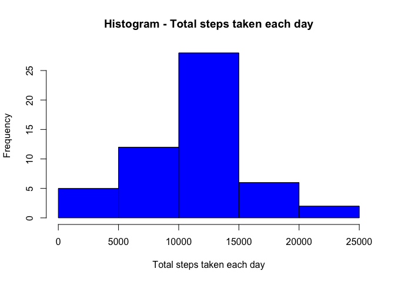
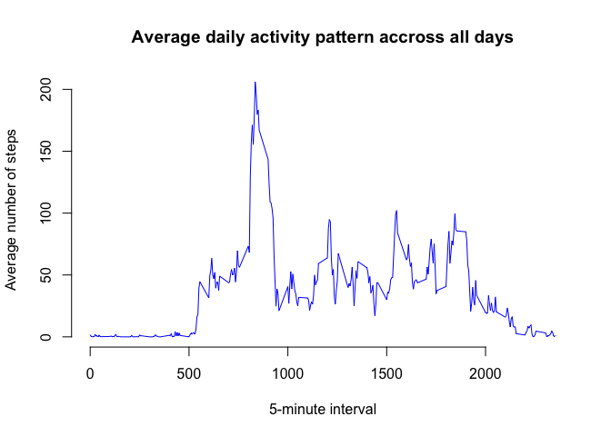
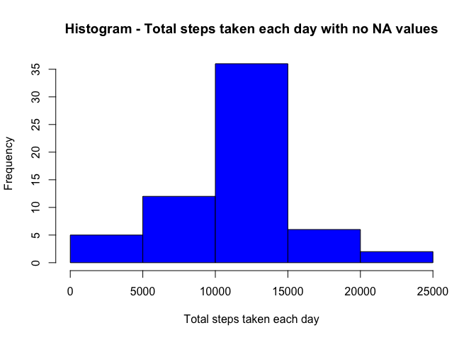
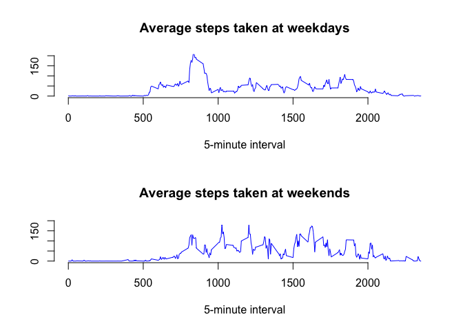

# Reproducible Research: Peer Assessment 1
# Introduction
This is the report to fullfill the Peer Assignment 1 of the Reproducible Research module in the Data Science specialization course.

The explanation of the files submitted to fullfill the assignment can be read in the Readme file of the repo.

Before the code to fullfill the assignment there is some initialization code.


```r
# adjust Locale settings
Sys.setlocale("LC_ALL", "English")
```

```
## Warning in Sys.setlocale("LC_ALL", "English"): OS reports request to set
## locale to "English" cannot be honored
```

```
## [1] ""
```

```r
# clean the environment
rm(list=ls(all=TRUE))
```

## Loading and preprocessing the data
Once forked the original repo from GitHub, here is the code to:  
- Unzip the file that contains the dataset.  
- Load the .csv file that contains data.  
- Have a quick look at the row data.  


```r
# unzip dataset file
unzip("activity.zip")
# read the data
row_data <- read.csv("activity.csv")
# quick look at the row data
summary(row_data)
```

```
##      steps                date          interval     
##  Min.   :  0.00   2012-10-01:  288   Min.   :   0.0  
##  1st Qu.:  0.00   2012-10-02:  288   1st Qu.: 588.8  
##  Median :  0.00   2012-10-03:  288   Median :1177.5  
##  Mean   : 37.38   2012-10-04:  288   Mean   :1177.5  
##  3rd Qu.: 12.00   2012-10-05:  288   3rd Qu.:1766.2  
##  Max.   :806.00   2012-10-06:  288   Max.   :2355.0  
##  NA's   :2304     (Other)   :15840
```

```r
head(row_data)
```

```
##   steps       date interval
## 1    NA 2012-10-01        0
## 2    NA 2012-10-01        5
## 3    NA 2012-10-01       10
## 4    NA 2012-10-01       15
## 5    NA 2012-10-01       20
## 6    NA 2012-10-01       25
```

Having inspected the data, no further preprocessing the data is made.

## What is mean total number of steps taken per day?
This is the code to calculate the mean total number of steps taken per day, ignoring the missing values in the dataset.

```r
# total number of steps taken per day
total_steps_per_day<-aggregate(steps~date,data=row_data,sum,na.rm=TRUE)
```

This is the code to generate a histogram of the total number of steps taken each day.

```r
hist(total_steps_per_day$steps,col="blue",xlab="Total steps taken each day", main="Histogram - Total steps taken each day")
```

 

This is the code to generate the mean and median of the total number of steps taken per day.

```r
# mean
mean_steps_taken_daily <-mean(total_steps_per_day$steps)
# median
median_steps_taken_daily <-median(total_steps_per_day$steps)
```

The **mean** of the total number of steps taken per day is 1.0766189\times 10^{4}.  
The **median** of the total number of steps taken per day is 10765.


## What is the average daily activity pattern?

This is the code to generate a time series plot of the 5 min. interval (x-axis) and the average number of steps taken, averaged across all days (y-axis).


```r
# 1. calculate the average of steps for the 5' interval
average_steps_per_interval <- aggregate(steps~interval, data=row_data, mean)
# 2. plot
plot(average_steps_per_interval$interval, average_steps_per_interval$steps,type="l", frame=FALSE, col="blue",main="Average daily activity pattern accross all days",xlab="5-minute interval", ylab="Average number of steps")
```

 

This is the code to calculate which 5-minutes interval, on average accross all the days in the dataset, that contains the maximum number of steps.

```r
max.interval <- average_steps_per_interval[which.max(average_steps_per_interval$steps),]
```

The 5-minutes interval witx maximum number of steps, on average accross all the days in the dataset is 835 and the number of steps on average accross all the days for this interval is 206.1698113.  


## Imputing missing values

This is the code to calculate the total number of missing values in the dataset.

```r
total_rows_with_NAs <- sum(is.na(row_data$steps))
```

The total number of missing values in the dataset is 2304

The **strategy to fill the empty values in the dataset** is to use the mean of the interval accross all days given the observation of the original dataset that shows there are NA values spread among all days.

This is the code to create a new dataset that is equal to the original dataset but with all the missing data filled in according to the strategy mentioned above. The summary of the new dataset shows that there are no NA values.


```r
# new dataset
no_na_data <- row_data
# rows with na values
rows_with_na_values <- which(is.na(row_data))
# fill na values with average values for the interval accross all days
for (i in rows_with_na_values) { 
  no_na_data[i, 1] <- average_steps_per_interval[average_steps_per_interval$interval==no_na_data[i,3], 2]
}
summary(no_na_data)
```

```
##      steps                date          interval     
##  Min.   :  0.00   2012-10-01:  288   Min.   :   0.0  
##  1st Qu.:  0.00   2012-10-02:  288   1st Qu.: 588.8  
##  Median :  0.00   2012-10-03:  288   Median :1177.5  
##  Mean   : 37.38   2012-10-04:  288   Mean   :1177.5  
##  3rd Qu.: 27.00   2012-10-05:  288   3rd Qu.:1766.2  
##  Max.   :806.00   2012-10-06:  288   Max.   :2355.0  
##                   (Other)   :15840
```

This is the code to make a histogram of the total number of steps taken each day.

```r
# calculate data
total_steps_per_day_no_na <-aggregate(steps~date,data=no_na_data,sum,na.rm=TRUE)
# plot histogram
hist(total_steps_per_day_no_na$steps,col="blue",xlab="Total steps taken each day", main="Histogram - Total steps taken each day with no NA values")
```

 

This is the code to calculate the mean and the median of steps taken per day.


```r
# Mean of steps taken per day
mean_steps_taken_daily_no_na <- mean(total_steps_per_day_no_na$steps)
# median of steps taken per day
median_steps_taken_daily_no_na <- median(total_steps_per_day_no_na$steps)
```

The **mean** of the total number of steps taken per day is 1.0766189\times 10^{4}.  
The **median** of the total number of steps taken per day is 1.0766189\times 10^{4}.

**Note:** The values differ slightly from the estimates in the first part of the assignment. The variation is a slight increase due to the filling of the NA values with the mean values of the 5-minutes intervals. In the histogram this increase can be appreciated as an increase in the total steps taken each day in the central range of values due to the replacement of the NA values with average values, that leads to a greater concentration of values around the center of the distribution.


## Are there differences in activity patterns between weekdays and weekends?

This is the code to generate a new factor variable in the dataset with two levels - "weekday" and "weekend" indicating wether a given date is a weekday or a weekend day.


```r
# convert dates column to R Date type
no_na_data$date <- as.Date(no_na_data$date,"%Y-%m-%d")
# create a logical vector to indicate date in a row is weekday or weekend. 
# Note that I have used the Spanish translation for Saturday and Sunday as I had trouble to change the Locale Settings from RStudio
week_days <- weekdays(no_na_data$date) %in% c("Saturday", "Sunday", "sabado", "domingo")
# create the new factor variable
no_na_data$weekend_or_weekday <- ifelse(week_days, "weekend", "weekday")
```

This is the code to generate a panel plot containing a time series plot of the 5-minute interval (x-axis) and the average number of steps taken, averaged accross all weekdays or weekend days (y-axis).
Note: I have used the plot function, no other external package to represent graphics.


```r
# calculation of average steps grouping by interval on weekdays 
average_steps_taken_weekdays_by_interval <- aggregate(steps ~ interval, subset(no_na_data, weekend_or_weekday=="weekday"), mean)
# calculation of average steps grouping by interval on weekends
average_steps_taken_weekends_by_interval <- aggregate(steps ~ interval, subset(no_na_data, weekend_or_weekday=="weekend"), mean)
# print the plot
par(mfrow=c(2,1))
plot(x=average_steps_taken_weekdays_by_interval$interval, y=average_steps_taken_weekdays_by_interval$steps,main="Average steps taken at weekdays", xlab="5-minute interval", ylab="",type='l', ylim=c(0,200), frame=FALSE, col="blue")
plot(x=average_steps_taken_weekends_by_interval$interval, y=average_steps_taken_weekends_by_interval$steps,main="Average steps taken at weekends", xlab="5-minute interval", ylab="",type='l', ylim=c(0,200), frame=FALSE, col="blue")
```

 

**Note:** The activity at the weekend starts a bit late and it is less concentrated in the morning, being more distributed along the day.
